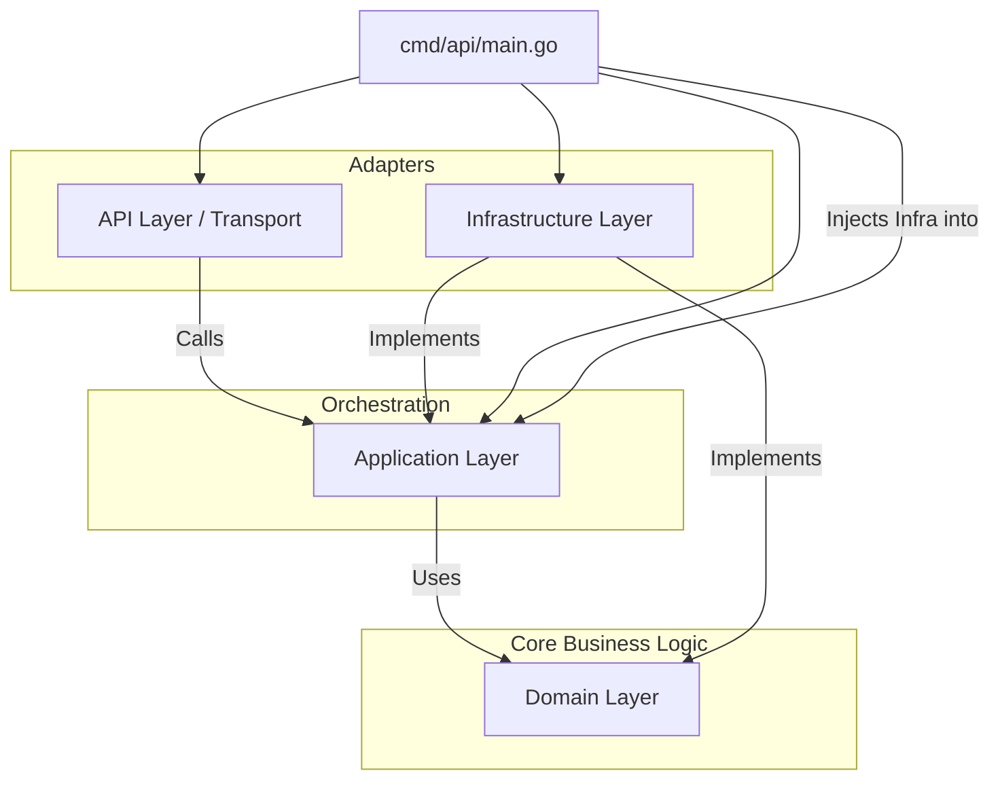

# Architecture Documentation

The **Numismatic App** follows a **Clean Architecture** (also known as Hexagonal Architecture or Ports and Adapters) approach. This ensures separation of concerns, testability, and independence from external frameworks and drivers.

## High-Level Overview

The system is divided into four main layers:

1.  **Domain Layer** (`internal/domain`): Contains the business logic, entities, and interface definitions. It has NO dependencies on other layers.
2.  **Application Layer** (`internal/application`): Orchestrates the business logic using domain entities and interfaces. It depends only on the Domain Layer.
3.  **Infrastructure Layer** (`internal/infrastructure`): Implements the interfaces defined in the Domain/Application layers. This includes database adapters, external API clients (Gemini), and file storage.
4.  **Interface/API Layer** (`internal/api`): Handles HTTP requests, parses input, and invokes the Application Layer. Implemented using `Go Fiber`.

## Dependency Graph

## detailed Layer Description

### 1. Domain Layer (`internal/domain`)
- **Responsibility**: Defines the core business concepts and the contracts (interfaces) for external services.
- **Key Files**:
    - `coin.go`: Defines the `Coin` entity and `CoinRepository` interface.
    - `dashboard.go`: Defines stats structures.
    - `image.go`: Defines `ImageService` interface.

### 2. Application Layer (`internal/application`)
- **Responsibility**: Implements use cases. It acts as the glue between the API and the Domain.
- **Key Components**:
    - `CoinService`: Handles logic for adding coins, processing images (cropping, background removal), and analyzing coins with AI.

### 3. Infrastructure Layer (`internal/infrastructure`)
- **Responsibility**: Provides concrete implementations for the interfaces defined in the core.
- **Key Components**:
    - `postgres.go`: valid implementation of `CoinRepository` using `pgx` and `sqlc`.
    - `gemini/`: Client for Google Gemini AI.
    - `storage/`: Local file system storage implementation.
    - `image/`: Image processing implementations (Vips, Rembg).

### 4. API Layer (`internal/api`)
- **Responsibility**: HTTP entry point.
- **Framework**: [Fiber](https://gofiber.io/)
- **Key Components**:
    - `handler.go`: HTTP handlers mapping routes to service methods.
    - `router.go`: Route definitions and middleware setup.

## Technology Stack

- **Language**: Go
- **Web Framework**: Fiber
- **Database**: PostgreSQL
- **SQL Generation**: sqlc
- **AI**: Google Gemini
- **Image Processing**: libvips, rembg
- **Migration**: custom SQL migration runner
