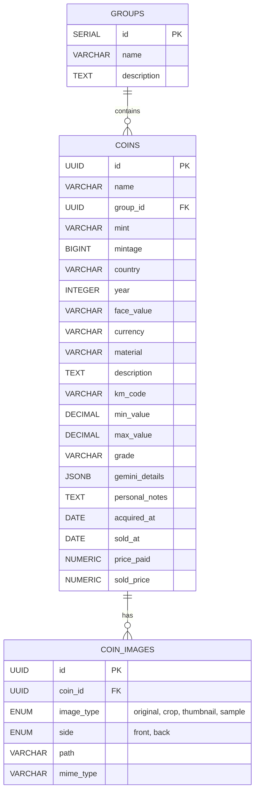

# Database Documentation

The application uses **PostgreSQL** as its relational database. The schema is designed to support the core entity `Coin` and its related data like `Images` and `Groups`.

## ER Diagram

## Tables

### `coins`
The central table storing all numismatic data.
- **Primary Key**: `id` (UUID v4)
- **JSONB**: `gemini_details` stores the raw analysis result from the AI model, allowing for schema-less flexibility for AI data.
- **Indexes**: `country`, `year` for faster filtering.

### `coin_images`
Stores metadata about the images associated with a coin.
- **Types**:
    - `original`: The raw upload.
    - `crop`: The background-removed, circular crop.
    - `thumbnail`: A smaller version for list views.
    - `sample`: Reference images (unused currently).

### `groups`
Simple categorization for coins (e.g., "My Gold Collection", "Swap List").

## Data Access Strategy

We use **sqlc** to generate type-safe Go code from SQL queries.
- **Queries Location**: `internal/infrastructure/db/queries/`
- **Generated Code**: `internal/infrastructure/db/`
- **Migration**: Schema is defined in `schema.sql`.

## Enums
- `image_type`: Ensures data integrity for image categorization.
- `coin_side`: `front` (obverse) or `back` (reverse).
