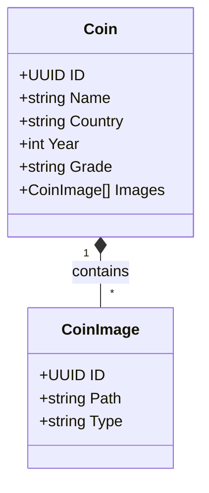

# Domain Driven Design

The application follows DDD principles to model the complex business logic of numismatics management.

## Domain Model

### Entities

#### Coin
The aggregate root. Represents a single physical coin in the collection.
- **Identity**: `UUID`
- **Responsibilities**:
    - Holds all numismatic data (Country, Year, Mint, Grade).
    - Manages its images.
    - Tracks acquisition and sales data.
    - Stores the AI analysis results.

#### Group
A simple entity for organizing coins.
- **Identity**: `int` (Simple serial ID)
- **Role**: Categorization (e.g., "Silver Coins", "Doubles").

### Value Objects
While mostly represented as primitive types in Go for simplicity, conceptually:
- **Grade**: A standardized string (e.g., "MBC", "EBC", "FDC"). The system normalizes these input strings.
- **Money**: `FaceValue`, `PricePaid`, `SoldPrice` (stored as `BigDecimal`/`Numeric`).

### Domain Services

#### ImageService
Responsible for the complex logic of image manipulation, which is domain-agnostic but critical for the domain's "Digital Twin" concept.
- Background removal.
- Circle cropping.
- Thumbnail generation.

#### AIService
Abstracts the interaction with LLMs (Google Gemini). The domain cares about the *Analysis Result*, not the provider.
- `AnalyzeCoin(images) -> CoinAnalysisResult`

## Bounded Contexts
Currently, the application operates within a single bounded context: **Collection Management**.
Future contexts could include:
- **Marketplace**: Buying/Selling logic.
- **Social**: Sharing collections.
